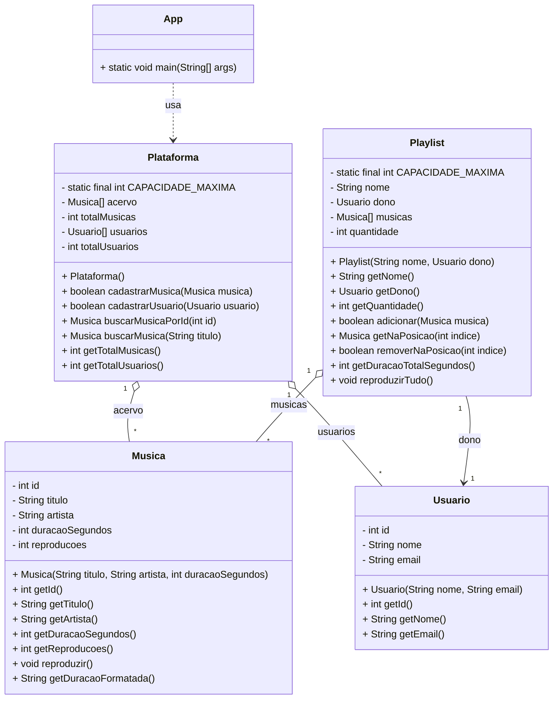

# Diagrama de classes — SonoraV1Lista03

```mermaid
classDiagram
    class Musica {
        - int id
        - String titulo
        - String artista
        - int duracaoSegundos
        - int reproducoes
        + Musica(String titulo, String artista, int duracaoSegundos)
        + int getId()
        + String getTitulo()
        + String getArtista()
        + int getDuracaoSegundos()
        + int getReproducoes()
        + void reproduzir()
        + String getDuracaoFormatada()
    }

    class Usuario {
        - int id
        - String nome
        - String email
        + Usuario(String nome, String email)
        + int getId()
        + String getNome()
        + String getEmail()
    }

    class Plataforma {
        - static final int CAPACIDADE_MAXIMA
        - Musica[] acervo
        - int totalMusicas
        - Usuario[] usuarios
        - int totalUsuarios
        + Plataforma()
        + boolean cadastrarMusica(Musica musica)
        + boolean cadastrarUsuario(Usuario usuario)
        + Musica buscarMusicaPorId(int id)
        + Musica buscarMusica(String titulo)
        + int getTotalMusicas()
        + int getTotalUsuarios()
    }

    class Playlist {
        - static final int CAPACIDADE_MAXIMA
        - String nome
        - Usuario dono
        - Musica[] musicas
        - int quantidade
        + Playlist(String nome, Usuario dono)
        + String getNome()
        + Usuario getDono()
        + int getQuantidade()
        + boolean adicionar(Musica musica)
        + Musica getNaPosicao(int indice)
        + boolean removerNaPosicao(int indice)
        + int getDuracaoTotalSegundos()
        + void reproduzirTudo()
    }

    class App {
        + static void main(String[] args)
    }

    Plataforma "1" o-- "*" Musica : acervo
    Plataforma "1" o-- "*" Usuario : usuarios
    Playlist "1" o-- "*" Musica : musicas
    Playlist "1" --> "1" Usuario : dono
    App ..> Plataforma : usa
```
